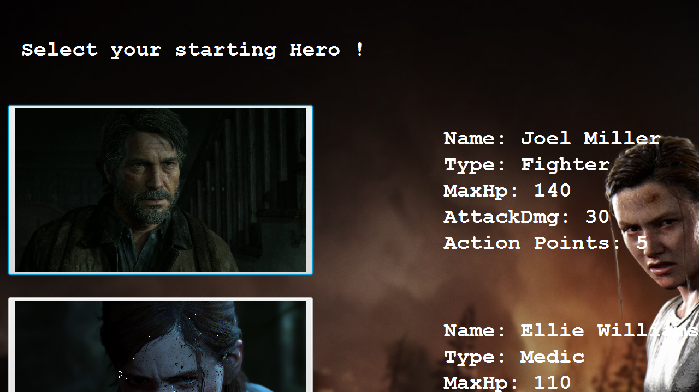

# The Last of Us: 2D Game

A turn-based grid game in Java/JavaFX, loosely themed on The Last of Us. You pick a squad of heroes, move them around a 15x15 map, fight off zombies, and collect supplies and vaccines.

## Gameplay

- Choose heroes from a roster loaded out of a CSV file (`Heroes.csv`), each with a class: Fighter, Medic, or Explorer
- Each hero has a limited number of actions per turn, move, attack, or use an item
- Zombies attack automatically at the end of each turn and new ones spawn as the game goes on
- Collectibles on the map: supply crates and vaccines
- The game ends when your heroes are wiped out or you clear the map

## Code structure

- `engine/Game.java` - turn loop, zombie spawning, hero loading
- `model/characters/` - `Hero`, `Fighter`, `Medic`, `Explorer`, `Zombie`, `Direction`
- `model/collectibles/` - `Supply`, `Vaccine`
- `model/world/` - the grid: `Cell`, `CharacterCell`, `CollectibleCell`, `TrapCell`
- `exceptions/` - custom exceptions for illegal moves, out-of-range targets, and running out of actions
- `views/` - JavaFX screens (`launch.java`, `StartedGame.java`, `AttackAndCure.java`)

## Running it

Needs JavaFX on the classpath (built as an Eclipse project, `.classpath` and `.project` are included). Import into Eclipse, add the JavaFX SDK to the build path, and run `views/launch.java`.

## Screenshots

Character art (Joel, Ellie, etc.) is official The Last of Us artwork used as portraits, not original art.
